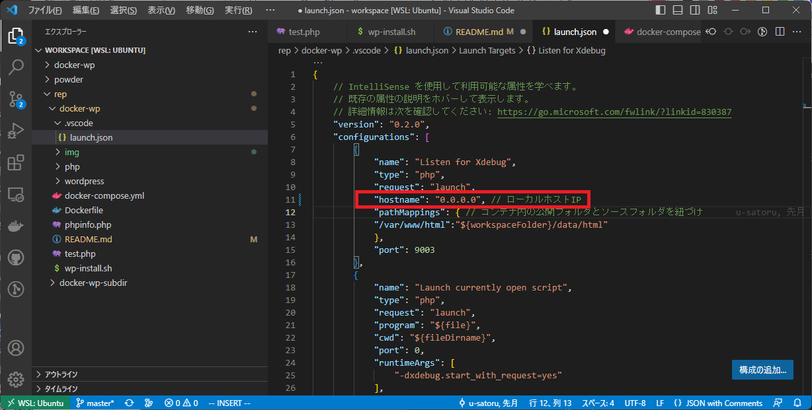

# WordPressサブディレクトリ版開発環境コンテナ構築手順書

**前提条件**

* [Docker Desktop](https://www.docker.com/products/docker-desktop/)がインストールされていること。
* [Docker Hub](https://hub.docker.com/)へアカウント登録していること。
* このコンテナはWSL2(Ubuntu)上のvolumeを使用するものです。
*  WSL上のDockerエンジンを有効にする。(要Dockerエンジン再起動)
  
* VSCodeの拡張機能として『Remote Development』と付随する４つ（計５つ）をインストールしていること。
  
* VSCodeの拡張機能として『WSL』をインストールしていること。
  
* VSCodeローカルにインストール済みの拡張機能でWSL:Ubuntuへもインストールが必要なものはインストールしていること。
---
## 手順 ##
1. コンテナフォルダーを任意の場所へコピーする。
   フォルダー名（例）：ddocker-wp-subdir

2. コンテナディレクトリへ移動する。
3. docker composeとBuildする。
   ※既に同一イメージが存在している場合はBuildする必要は無い
   ```
   docker compose up -d --build
   ```
   同一imageが存在している場合
   ```
   docker compose up -d
   ```
4. コンテナプロセスが起動しているか確認する。
   ```
   > docker ps
   CONTAINER ID   IMAGE                     COMMAND                  CREATED          STATUS          PORTS                                NAMES
   e052681f0c7b   wordpress:php7.4-apache   "docker-entrypoint.s…"   49 seconds ago   Up 47 seconds   0.0.0.0:8080->80/tcp                 wordpress-myproject
   63c5a90ffd88   phpmyadmin/phpmyadmin     "/docker-entrypoint.…"   49 seconds ago   Up 47 seconds   0.0.0.0:32779->80/tcp                phpmyadmin-myproject
   2fb0c3d796f2   mysql:5.7                 "docker-entrypoint.s…"   49 seconds ago   Up 48 seconds   33060/tcp, 0.0.0.0:32780->3306/tcp   mysql-myproject
    ```
5. WordPressのイニシャライズに若干時間がかかるようなので数分間程待つ。
6. WordPressインストール用シェルスクリプトへ実行権限を与える。
   ```
   docker exec wordpress-myproject chmod +x /tmp/wp-install.sh
   ```
7. WordPressとプラグインとテーマをシェルスクリプトにてインストールする。
   ※要修正※
   ```
   docker exec wordpress-myproject /tmp/wp-install.sh
   ```
9. WLS2上のパーミッションを変更
   sudo chmod -R a+w ./data/html

### 補足
* Windowsにファイルを配置し、volumeをマウントする場合。
  1. *手順8*は行わないこと。
  2.  WSL上のDockerエンジンを無効にする。(要Dockerエンジン再起動)
     
  3. docker-compose.yml の該当行を削除する。
    
  4. VSCodeの設定ファイル .vscode/launch.json の該当行を削除する。
    
